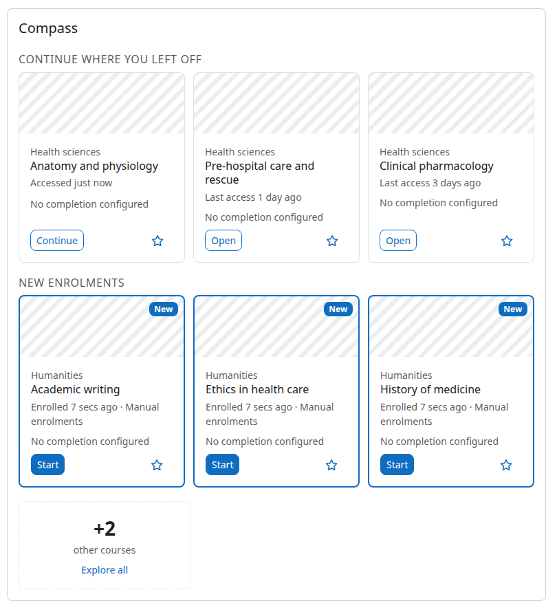
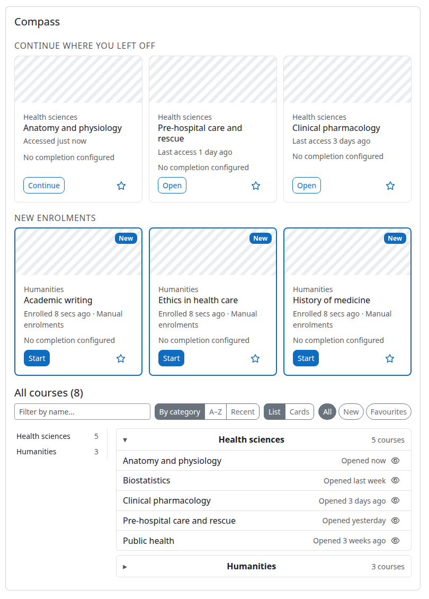

moodle-block_compass
====================

My courses by relevance, in three tiers, built for very large sites.

The standard "Course overview" block organises courses by time: start and end
dates. On sites where most courses have no end date and no completion rule that
classification degenerates into one long "in progress" list, expensive to build
and hard to scan. Compass organises the same enrolments by **relevance** instead:
what I was doing, what just arrived, what I marked as mine.

- **Tier 1 — attention.** Full cards (image, progress, button) for the courses
  the learner most likely wants right now: *Continue* (most recently accessed),
  *New enrolments* (enrolled in the last N days, never opened) and *Favourites*
  (the same star as the Course overview block). A few cards per strip, loaded in
  one request on first paint.
- **Tier 2 — frontier.** A ghost card carrying only a count: "+87 other courses".
  Counting is cheap; rendering is not.
- **Tier 3 — exploration.** A light list grouped by category, with a side index,
  instant filtering and rows that fetch their own details as they come into
  view, fetched only when the learner asks for it. Dormant courses are collapsed,
  and archiving them hides them in the Course overview block as well.

Design philosophy: **no tables of its own** (favourites through core, caches
through MUC, per-user state through user preferences), **the server ships a
shell and the browser renders**, and **scale is a requirement**: every endpoint
has a query budget enforced by an automated test. The plan is in `PLAN.md` and
the architecture decisions in `docs/adr/`.

**Status: feature complete for the first release.** All three tiers are built,
in both the full and the paged mode; the optional nightly pre-warming task is
built (ADR-003); tier 3 rows fetch their progress and course image only once
somebody can see them, and render as a compact list or as cards, remembered per
viewer (ADR-005); courses that have gone quiet gather in a Dormant group and
archived ones in an Archived group, with the archive shared with the Course
overview block (ADR-007); and the accessibility audit is an executable gate
rather than a document (ADR-008). The one planned piece not built is Phase 6 —
calendar action events on the cards — which the plan itself marks optional. The
current version is 2026090701. The first release, `v5.2-r1`, will declare
`MATURITY_BETA`, "feature complete, ready for preview and testing": the release
commit sets it, and the version in the repository still declares
`MATURITY_ALPHA`.

Requirements
------------

- **Moodle 5.2 only.** `version.php` declares `$plugin->supported = [502, 502]`
  and `$plugin->requires = 2026042000`; the plugin has been developed and tested
  on 5.2 and on nothing else, and its whole client is React under `js/esm`, which
  core builds and serves from 5.2 on.
- PHP 8.3.0 or later, which is what Moodle 5.2 itself requires
  (`admin/environment.xml:5124`), with the `intl` extension Moodle 5.2 also
  requires (`:5197`) — the server-side search of paged mode uses its
  `Normalizer` so that it matches names exactly as the browser does.
- A shared in-memory cache store (Redis) is strongly recommended — see below.

Installation
------------

Install the plugin like any other plugin to folder `/blocks/compass`.

See http://docs.moodle.org/en/Installing_plugins for details on installing
Moodle plugins.

After installation the block works without configuration. Learners add it to
their Dashboard through *Edit mode > Add a block*, or an administrator adds it to
the default Dashboard under *Site administration > Appearance > Default Dashboard
page*.

Cache stores (read this before a large rollout)
-----------------------------------------------

Compass keeps four MUC application caches, declared in `db/caches.php`:

| Definition     | Key            | Content                                            |
|----------------|----------------|----------------------------------------------------|
| `coursemeta`   | course id      | raw name, category id, visibility, completion flag, context columns (no image: core caches it) |
| `categorymeta` | category id    | raw category name, path, depth, context columns (core's own category cache lasts one request) |
| `inventory`    | user id        | one row per enrolment plus the validity stamp, without course data |
| `details`      | user + course  | progress percentage                                |

Map all four to a **shared in-memory store, Redis by preference**. A plugin
cannot choose a store for you; it can only tell you what it needs.

**Setting one up.** Go to *Site administration > Plugins > Caching >
Configuration*, which opens the *Cache administration* page.

1. Under *Configured store instances*, find the **Redis** row and follow
   *Add instance*.
2. Fill the store form: *Store name* (any name you will recognise in the
   mappings), *Server(s)* (host, `host:port`, or a Unix socket path), *Key
   prefix* (up to five characters, so several Moodle instances can share one
   Redis server) and *Use serializer*. The serializer defaults to *Default PHP
   serializer*; *Igbinary serializer* is offered only when phpredis was built
   with igbinary support, and it roughly halves what the caches occupy — see
   *Sizing* below.
3. Map the definitions to it. Either use *Edit mappings* on each of the four
   Compass definitions under *Known cache definitions* — `coursemeta`,
   `categorymeta`, `inventory` and `details` — or, if the store is to serve the
   whole site, set it as the application store under *Stores used when no
   mapping is present*, which covers these four along with everything else.

**Without a shared in-memory store the block still works, but performance can be
severely degraded.** Every Dashboard visit then falls back to the file store of
each web node, the per-user caches are rebuilt on every node separately, the
nightly pre-warming task warms nothing any web node will read, and on a site with
hundreds of thousands of users the first-paint budget cannot be met. The
plugin's settings page repeats this notice.

Sizing
------

Every figure below names where and when it was measured. None of them is a
model: re-measure on your own hardware before planning against them.

**What one cached inventory occupies.** Measured 2026-09-04 inside the m502
webserver container on PHP 8.4, over the ten-integer rows the inventory actually
stores (`docs/perf/2026-09-04-bench-postgres17.md:63-67`):

| Enrolments in the entry | Default store, PHP `serialize()` | With igbinary selected |
|---|---|---|
| 300   | 40.9 KB | 18.4 KB |
| 2 000 | 272 KB  | 122 KB  |
| 3 000 | 408 KB  | 183 KB  |

The MUC Redis store serialises with PHP's `serialize()` by default
(`cache/stores/redis/lib.php`), so the left column is what an ordinary
installation pays; igbinary is a per-instance option on the store form and is
available only when phpredis was built with it. One entry per user with a
current inventory, expiring after 24 hours at the latest.

PLAN.md §6.2 estimated a 2 000-enrolment entry at about 60 KB. The measurement
above puts it at 272 KB on a default store — **4.5 times the estimate**. The
number in this README is the measured one, and the estimate is recorded here
only so that nobody plans a Redis instance from it.

**Database time.** Measured 2026-09-04 against PostgreSQL 17.10 in a laptop
container, on a seeded copy of the core tables — 1 075 000 enrolments over
100 000 courses, 645 000 last-access rows
(`docs/perf/2026-09-04-bench-postgres17.md:24-33,41-55`):

- an ordinary user's whole first paint — Continue, New, Favourites and the
  counts together — is **under 6 ms** of database time, with every statement
  index-driven and no sequential scan;
- the heaviest user measured, with 3 000 enrolments, costs **about 140 ms** of
  database time for the same first paint, inside the 150 ms budget for
  `get_attention`; the sequential scans behind that figure are an artefact of the
  bench's small dimension tables, which a real site of this size would not have;
- validating a cached inventory is one statement: 9.4 ms at 50 enrolments,
  15.2 ms at 3 000. Rebuilding it is one more: 3.6 ms and 28.1 ms.

**Per-request budgets, as shipped and as tested.** The *Reads* column is
asserted by a PHPUnit test that fails when the endpoint exceeds it; the
*Payload* column is a measured ceiling that no test enforces. Reads are counted
with `$DB->perf_get_reads()` across a whole request, so core's own reads —
config, strings, contexts, `require_login()` — are inside these numbers, not
beside them (`CLAUDE.md` §6.6):

| Endpoint | Reads per request | Payload |
|---|---|---|
| `get_attention` | ≤ 6 with the shared layers warm; 7 fully cold — plus 1 at the web-service layer (the user-context lookup) | ≤ 20 KB |
| `get_inventory` (500 enrolments) | ≤ 3 with the user's inventory cold and the shared layers warm, 3 on a valid hit; at most 6 fully cold — plus 1 at the web-service layer | ≤ 40 KB |
| `get_inventory` (paged mode, headers) | ≤ 3 with the shared layers warm — plus 1 at the web-service layer | ≤ 5 KB (a group is ~60 bytes) |
| `get_inventory_rows` (100 rows) | ≤ 3 with the shared layers warm — plus 1 at the web-service layer | ≤ 12 KB (≈ 115 bytes per row) |
| `search_inventory` (50 hits) | ≤ 3 with the shared layers warm — plus 1 at the web-service layer | ≤ 7 KB (≈ 115 bytes per row plus ≈ 18 for the group id) |
| `get_card_details` (24 ids) | 1 when every answer is cached or untracked; + 1 + completion for the courses that must be computed | ≤ 10 KB |
| pre-warming task, per user | 1 with the shared layers warm, up to 4 cold — plus 1 selection read per batch of 200 and 1 count per run | n/a |

So paged mode costs, per learner interaction, one request of at most 3 reads and
12 KB to open a group or to fetch its next 100 rows, and one of at most 3 reads
and 7 KB per settled search. Neither issues SQL of its own: both are derived
from the cached inventory and the two shared layers.

**The scenario the plugin was designed against** is PLAN.md §6's: one million
users, `{user_enrolments}` in the region of 20 GB, and thousands of concurrent
Dashboard hits. That is the plan's scenario, not a measurement — what has been
measured is everything above.

Usage
-----

**Administrators** find the settings under *Site administration > Plugins >
Blocks > Compass*, in this order:

| Setting | Default | What it does |
|---|---|---|
| Cards per strip (`attention_max`) | 3 | How many cards each tier 1 strip shows. Whatever does not fit is counted on a ghost card. |
| Days an enrolment stays new (`new_days`) | 30 | A course enrolled in within this many days, and never opened, belongs to *New enrolments*. |
| Show favourites (`enable_favourites`) | on | Show the *My favourites* strip and the star on each card. Turning it off hides the plugin's own star; core's favourites are untouched and the Course overview block keeps its own. |
| Grouping depth (`group_depth`) | 1 | Category depth that forms the groups of the full list. 1 groups by top-level category, 2 by their subcategories. Courses in shallower categories group under their own. |
| Maximum courses listed in full (`inventory_max`) | 250 | Above this many courses the full list switches to paged mode (next section). A value below 1 falls back to the default. |
| Show the search box (`enable_search`) | on | Show the search box above the full list. |
| Show the category index (`show_index`) | on | Show the side index of categories beside the full list on wide screens. |
| Months before a course is dormant (`dormant_months`) | 12 | A course not opened for this many calendar months — or never opened and enrolled longer ago than that — is gathered into the Dormant group instead of padding its category. |
| Default view for the full course list (`default_view`) | list | Which view the full list opens in for a viewer who has never chosen: the compact list, or cards with the course image. Each viewer's own choice overrides it. |
| Hide the block title (`hide_block_title`) | off | Render the block without its title bar. Core then renders no block heading at all, so the plugin's own headings move one level up to keep the document's heading ladder unbroken (ADR-008). |
| Pre-warm active users (`enable_prewarm`) | off | Run the nightly sweep at all. Never set means off. |
| Pre-warm users active in the last (`prewarm_days`) | 7 | Only users whose last access falls within this many days are warmed. |
| Pre-warming time budget (`prewarm_budget_seconds`) | 10 minutes (600 s, minimum 60) | How long each run may work; it stops between users when the budget is reached and resumes from the same place the next night. |

The settings page closes with the cache-store notice, which is the one thing on
it that is not a setting.

**Learners** see the block on their Dashboard. *Continue where you left off*
lists the most recently opened courses (completed ones leave the strip), *New
enrolments* the courses they were enrolled in recently and never opened, with
the enrolment method and any deadline, and *My favourites* the starred courses.
Each strip shows up to `attention_max` cards; whatever does not fit is counted on
a ghost card, and pressing it opens *All courses* in place.

*All courses* lists every active course grouped by category (at the depth the
administrator chose), with a side index on wide screens, a search box, sorting by
category, name or last opened, and chips for new enrolments and favourites.
Two of its groups are not categories and come after the ones that are, both
closed:

- **Dormant** gathers the courses that have gone quiet — not opened for
  `dormant_months`, or never opened and enrolled longer ago than that — so they
  stop padding their categories. It carries an **Archive all** control, which
  asks for confirmation and then archives every course in the group at once.
- **Archived** holds the courses the learner has removed from view. Its rows
  arrive when the group is first opened, so an archive nobody looks at costs
  nothing on the way in.

Every row and every card carries an archive control, and unarchiving works the
same way from the Archived group. **The archive is the Course overview block's
own**: a course archived in Compass is the one the Course overview block lists
under its *Removed from view* filter, and a course removed from view there
appears under Archived here. Compass stores nothing of its own for it.

The full list renders either as a compact list or as cards with the course
image, chosen from the toolbar. The choice is remembered in the user preference
`block_compass_view` and switching costs no request: the rows and their details
are already in the browser, and only the rendering changes. `default_view` is the
site default for a viewer who has never chosen.

A course removed from view in the Course overview block is not in the strips or
in the category groups here either: it is one of the courses the Archived group
holds, and bringing it back there brings it back in both blocks.

Large enrolments: paged mode
----------------------------

A learner with more active courses than `inventory_max` (default 250) does not
receive the whole list in one response. For them *All courses* opens in **paged
mode** — the same groups, index, search box, sorting and chips, with three
differences:

- every group starts closed and shows its count; opening one loads its first
  100 courses, and a *Show more* button under the group loads the next 100 while
  there are more;
- the search box searches on the server — after a 300 ms pause in typing and
  from two characters on — over all the learner's courses, by course name, with
  the same rule as the instant search: case- and accent-insensitive, every word
  of the query anywhere in the name, in any order. It shows up to 50 matches and
  says so when there are more;
- chips and sorting apply to the rows of each opened group as they arrive; the
  count in a group header stays the group's total.

Nothing is configured per learner. The mode is decided on each request from the
learner's own count of active, visible, non-archived courses, so someone
hovering around the threshold may see the list switch between visits — with the
same groups and the same courses either way. The threshold is `inventory_max`
under *Site administration > Plugins > Blocks > Compass*; a value below 1 falls
back to the default. Paged mode adds no database queries of its own: headers,
pages and search are all derived from the learner's cached inventory, which is
why its per-request cost is the full list's. The reasoning and the measurements
are in `docs/adr/004-paged-mode.md`.

Pre-warming (optional)
----------------------

By default the caches fill lazily: a learner's first Dashboard visit of the day
builds their inventory, and every later visit reads it. On a very large site the
scheduled task **Pre-warm the course inventory of recently active users**
(`\block_compass\task\warm_active_users`) can move that first cost into the
night. The task is always listed under *Site administration > Server >
Scheduled tasks* — daily at 04:00 site time, at a random minute — and does
nothing until `enable_prewarm` is switched on; turning the setting on needs no
second visit to the task list.

| Setting                  | Default            | Meaning                                                                                                     |
|--------------------------|--------------------|-------------------------------------------------------------------------------------------------------------|
| `enable_prewarm`         | off                | Run the nightly sweep at all. Never set means off.                                                          |
| `prewarm_days`           | 7                  | Only users whose last access falls within this many days are warmed.                                        |
| `prewarm_budget_seconds` | 600 (minimum 60)   | Time budget per run; the task stops between users when it is reached and resumes from the same place the next night. |

Each run selects the active users in batches of 200 by ascending id and, for
each one, rebuilds their `inventory` entry and fills whatever their courses and
categories are missing from `coursemeta` and `categorymeta`. Progress
(`details`) is never pre-computed. The sweep's position lives in plugin config
(`prewarm_cursor`, `prewarm_since`, `prewarm_lastsweep`), so a sweep that does
not fit in one run continues the next night, and a new sweep — with a fresh
window — starts once the previous one has completed. The cron output shows the
number of users left at the start, one line per batch, and a closing line:
either "sweep complete" or "budget reached ... resuming at id ...".

What it buys is the cost of building the inventory on the first request of each
active user's day — noticeable for learners with thousands of enrolments,
negligible for ordinary ones — and nothing more: a pre-warmed entry is still
validated on its first use, users outside the window pay the fill as before, and
sites below a few hundred thousand users will not measure a difference. That is
why it is off by default.

**Multi-node sites without a shared cache store.** The task writes to whatever
cache store the cron node uses. Without Redis (or another shared in-memory
store) mapped to the four definitions, that is the cron node's own file store,
which the web nodes never read — pre-warming then warms nothing for anyone. Map
the stores first (see *Cache stores* above).

Accessibility
-------------

The bar is **WCAG 2.2 AA**, which is what the tooling measures and which
contains the 2.1 AA the plan asked for. It is enforced rather than described.

- **Core's own axe step runs inside every Behat scenario**, scoped to the block
  and with the `best-practice` extra tests, at the point in each scenario where
  the most is on screen. Moodle turns axe on by default in the Behat run
  configuration, and neither moodle-plugin-ci nor the runners used here pass
  anything that turns it off, so the check runs on every run and on every CI leg
  with nothing to configure and nothing to remember. It was proved
  non-vacuous before any fix was made: with the archive control stripped of its
  accessible name, the run reddened with three `button-name` violations, and went
  green again when the name was restored.
- **`tests/local/accessibility_rules_test.php` reads what axe cannot**, scanning
  the client sources and the stylesheet for ten rules: that the scan found its
  sources at all, that every image states an `alt` attribute, that no positive
  `tabindex` exists anywhere, that the stylesheet never removes an outline
  without replacing it, that both icon-only buttons name themselves, that every
  `role="group"` carries a name, that the heading ladder follows the block title,
  that brand-coloured text goes through the paired token, that the archive
  control declares a minimum target box, and that a list row wraps instead of
  overflowing. Each rule carries a guard asserting it had something to check.
- **Headings sit under core's block title.** Core renders the block title as an
  `<h3>`, so the plugin's section titles are `<h4>` and its card titles `<h5>`;
  when `hide_block_title` is on core renders no heading at all and each moves one
  rung up, chosen at render time rather than written into a component.
- **Brand-coloured text uses a token dark mode overrides to the body text
  colour**, which is the one colour dark mode guarantees readable. A brand's own
  dark tint is not: measured 2026-09-07 in a browser against a `#070093` navy
  brand, Bootstrap's dark emphasis tint of it reached **3.28:1** and the brand
  itself **1.10:1**, both under the 4.5:1 floor for text. Outlines, borders and
  backgrounds keep the plain brand token, whose floor is the 3:1 of non-text
  contrast.
- **The archive control declares a box of at least 1.5 rem** — 24 px at the
  default root size, the 2.5.8 Target Size minimum, which `btn-link btn-sm p-0`
  alone computes one pixel under — and **every row wraps** when its parts no
  longer fit on one line, so nothing overflows the block at narrow widths
  (1.4.10 Reflow; a list row overflowed by 19 px at 375 px before the fix).

**What is not covered.** A real screen reader — announcement order, verbosity,
and how NVDA, JAWS or VoiceOver handle the native `details` disclosure and the
live regions — has not been tested, only the accessibility tree read through
browser tooling. Neither has `forced-colors` mode / Windows High Contrast, which
the development platform does not provide. Both are stated rather than implied.
The findings, the measurements behind them and the limits are in
`docs/adr/008-accessibility-docs-and-release.md`.

Capabilities
------------

- `block/compass:myaddinstance` — add the block to one's own Dashboard (and,
  for administrators, to the default Dashboard). Default: authenticated user.
  The block lives on the Dashboard only, so there is no `addinstance`
  capability: core never evaluates it for a Dashboard-only block.

Web services
------------

Five read-only functions, all answering for the current user (none accepts a
user id), callable over AJAX after login and never by the guest account:

| Function                             | Purpose                                                                                                                  |
|--------------------------------------|--------------------------------------------------------------------------------------------------------------------------|
| `block_compass_get_attention`        | Tier 1: the three strips and the ghost counts.                                                                           |
| `block_compass_get_inventory`        | Tier 3: every active course grouped by category (`mode: full`), or the group headers with counts alone (`mode: paged`); dormant courses gather in a group of their own (id `-1`) and archived ones travel as a header alone (id `-2`). |
| `block_compass_get_inventory_rows`   | Paged mode: one page of up to 100 courses of one group, by cursor, under a chip (`all`, `new`, `favourites`) and a sort (`name`, `recent`). |
| `block_compass_search_inventory`     | Paged mode: up to 50 courses whose name contains every word of the query, each with its group.                          |
| `block_compass_get_card_details`     | Progress and the course image for a batch of up to 24 courses on screen.                                                |

A tier 3 row is the same six fields in all three of the functions that return
one — `id`, `name`, `opened` (the last access timestamp, or null), `new`, `fav`
and `dorm` (whether the course has gone quiet) — with `search_inventory` adding
`groupid`, since its hits arrive outside their groups.

Writes go to core's own services — the star through
`core_course_set_favourite_courses`; the list/cards view and archiving through
`core_user/repository`, which posts to core's preferences endpoint (the router, not the
legacy `core_user_update_user_preferences`) — so Compass ships no write function.

Privacy
-------

The plugin stores **one** thing of its own: the user preference
`block_compass_view`, the viewer's choice between the list and the cards view of
the full course list. It is declared in `lib.php` and exported by
`classes/privacy/provider.php`, which implements the metadata provider and
`user_preference_provider`.

Everything else it shows belongs to core and stays core's to export and to
delete. Courses, enrolments and progress are read, never copied: what the plugin
keeps of them are derived, expiring copies in MUC caches. Two rows a learner's
actions do create are core's own and are written through core's own services:
the favourite star (the `core_favourites` subsystem, component `core_course`,
itemtype `courses`, the same star the Course overview block sets) and the
archive (that block's `block_myoverview_hidden_course_*` preferences). Core
exports and deletes both, and Compass keeps no copy of either. The pre-warming
task writes the same cache entries a Dashboard visit writes and keeps its
position in three plugin configuration rows (`prewarm_cursor`, `prewarm_since`,
`prewarm_lastsweep`), which are site state, not personal data.

Testing
-------

- **PHPUnit: 265 tests across 25 files**, 1 815 assertions (measured 2026-09-07
  on Moodle 5.2.2+, PHP 8.4, PostgreSQL 17). Every external function has two
  tests beside it, one for behaviour and one for its budget; a budget test
  asserts the read count this README's *Sizing* table states, not whatever the
  code currently costs.
- **Behat: four smoke scenarios**, deliberately thin — the block appears with a
  recently opened course leading, the courses that do not fit are counted, the
  ghost card opens the full list and the search filters it in place, and
  archiving in Compass moves the course into the Course overview block's
  *Removed from view*. Each of the four carries core's axe step; the second runs
  with the block title hidden, so that configuration is measured too. Logic lives
  in PHPUnit.
- **52 mutation gates.** `mutations/gates.conf` names one guard per line together
  with the test that must redden when it is broken; `mdl mutate` breaks each in
  turn and runs the suite. A guard that reddens nothing is the finding.
- **The matrix**: `MOODLE_502_STABLE` on PHP 8.3 and 8.4, against PostgreSQL and
  MariaDB, with the static gates (phplint, phpcs and phpdoc at zero warnings, the
  Mustache lint, the development-leftover checker, `validate`, `savepoints`,
  grunt's eslint and stylelint) plus PHPUnit and Behat on each runtime leg.

Troubleshooting
---------------

- **The block is not shown.** It renders only for logged-in, non-guest users;
  Moodle hides a block whose content is empty.
- **The block shows "JavaScript is required".** The browser renders the block;
  JavaScript is not optional.
- **Slow Dashboard on a large site.** Check the four cache definitions are
  mapped to a shared in-memory store (see above), not to the default file store.
- **All courses opens with every group closed and a *Show more* button.** The
  learner is above `inventory_max`: that is paged mode, not a fault. Raise the
  threshold if you would rather ship the whole list to them.
- **A course vanished from All courses.** Check the Dormant and the Archived
  groups at the end of the list before anything else; both are closed by default.
  A course removed from view in the Course overview block arrives under Archived.
- **The pre-warming task logs "pre-warming is off".** That is the task's normal
  output while `enable_prewarm` is unset. Switch the setting on; the schedule
  needs no change.
- **Pre-warming runs but the morning Dashboards are no faster.** On a multi-node
  site check the four definitions are mapped to a shared store; the cron node's
  file store is invisible to the web nodes. On a small site there may simply be
  nothing to gain — see *Pre-warming*.

Credits
-------

Architecture (server shell, client-side rendering, core favourites) follows the
sibling plugin `block_dimensions`; the three-tier reading of "my courses" was
designed for Fundaseg.

License
-------

This plugin is licensed under the [GNU GPL v3 or later](http://www.gnu.org/copyleft/gpl.html).

Copyright: 2026 Anderson Blaine
